Ryan Lansdon
Chan Lee

Individual Project Checkpoint 3
 
# Homework 3
 
Front End and Back End are running separately as of now.
You need to run both front-end and back-end to run the program.
To run django, python 3 is recommended. We ran with python 3.7.
To run react, you need node 6.0 or higher.
 
## Set Up
 
System Requirements: I believe the program should run fine on any system.
However, django runs on python 3.
 
Front End
Go to file called 'frontend' from our directory.
Then go into ```gui``` file.
Then run `npm install` to get all the relevant builds required for build up.
Afterwards run ```npm start```to start the server.
 
 
Back End
Go to file called 'backend' from our directory.
Then ```source src/bin/activate``` to activate the django file.
Then run ```python django makemigrations ``` and run ``` python django migrate ```
to get all the necessary database models(schemas) to run the app. 
Then go into ```src``` file and run ```python django runserver``` to run server.
 
## Dependencies
 
### Front End
React-dom
React-router-dom
React-cookie
 
### Back End
django-rest-framework
django-cors-headers (Did not use yet. Will be used for integration) 
 
## Current status and Future Plans(including screen shots)
 
1) Ryan: React Tutorial, Setup login/signup system, user profile page
Chan: Connect Django with postgresql, create db models, user profile page
User testing: At this point, the user will be able to see the landing page, and either sign up or login to the site. After logging in, the user will be taken to their profile page, where they will see their information (pending completion of user profile page).

2) We connected Django with postgresql, created db models. However, there is some work left in db models other than user(built-in)such as foreign keys connection etc.We got the login and signup pages done, but did not yet integrate the user profile page. The reason for this is because we had to do more tutorials related to learning react and django rest-framework for this project to be doable than we originally thought. We have explained such issue to Sreesha and she gave us a set goal to have by this week and we accomplished it.

3) User testing: At this point, the user can see their profile page when they login in a complete manner and backend server methods for GET, POST, PUT, DELETE (rest API) works perfectly fine for our database model, NewProject and for login GET, POST worked properly with authentication. I have tested the backend with the 'Postman' program.
This goal seems reasonable for where we are at to this point. It should not be a problem achieving this goal.
 
1) Frontend screenshots: 
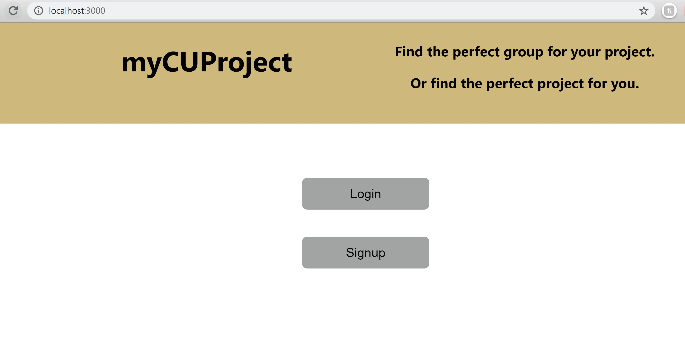
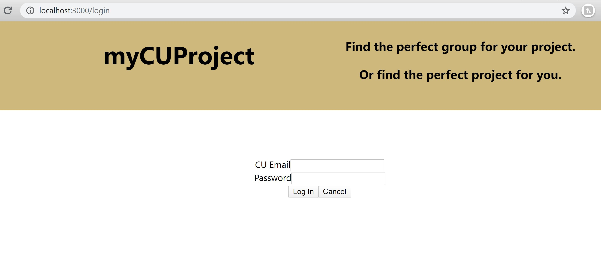
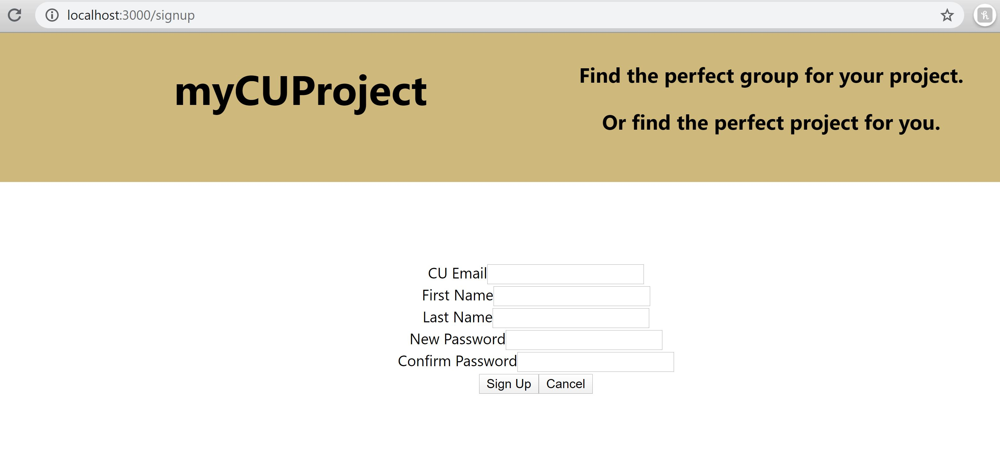
 
 
 
5) Backend screenshots:
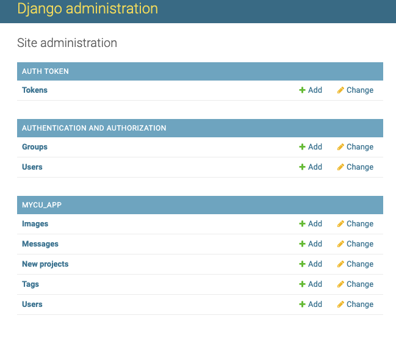
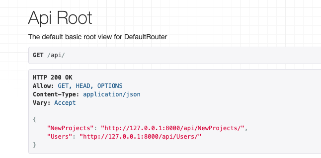
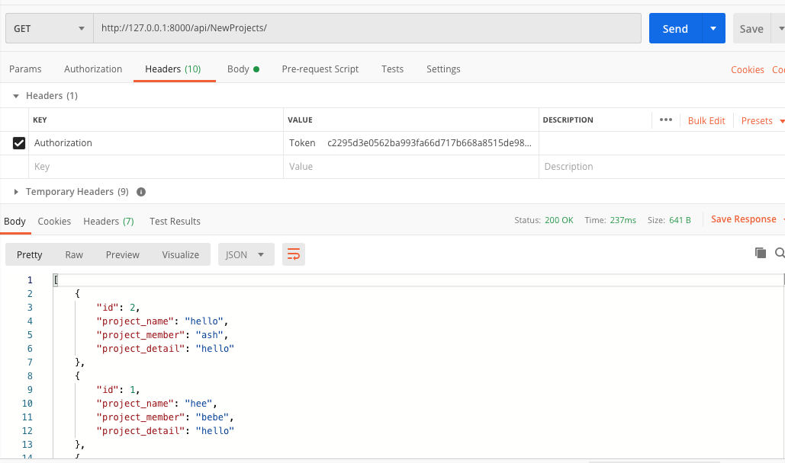
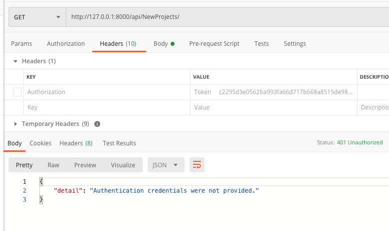
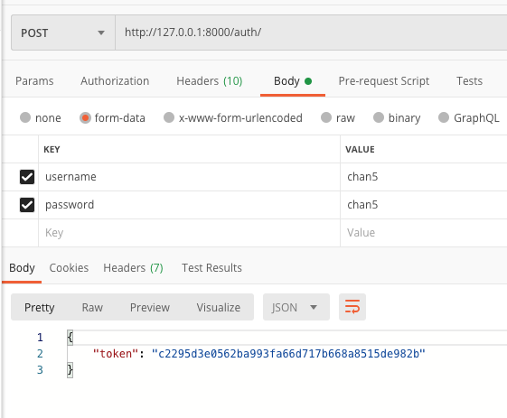
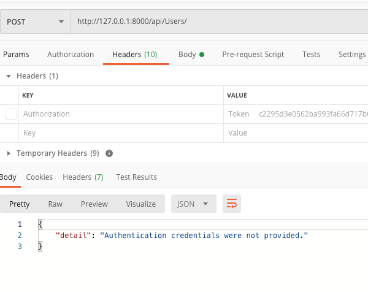
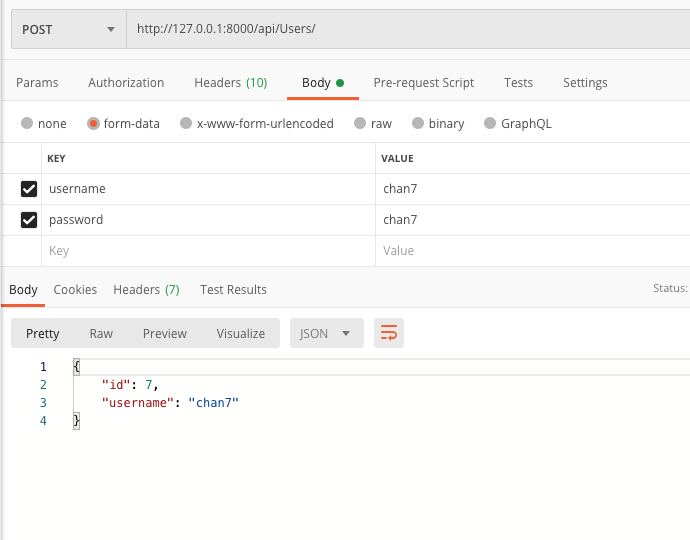
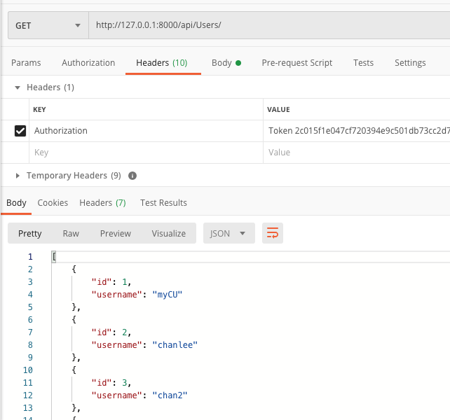
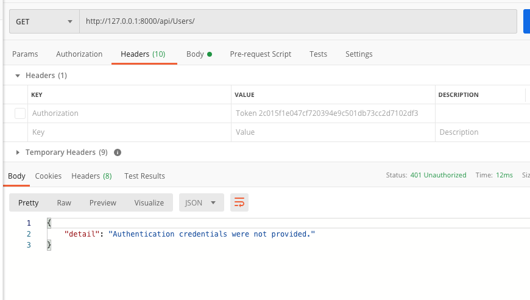
